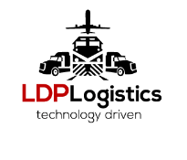

<!-- LDP LOGISTICS README -->

  

<h1 align="center">🌎 LDP Logistics Technology</h1>

  <em>Smart Freight. Smarter Technology. Global Reach.</em>

  
  
  

---

## 🚛 About Us

**LDP Logistics** is a full-service logistics and technology company based in **New Jersey, USA**, connecting freight, data, and global trade with precision. We deliver smart logistics solutions powered by data visibility, automation, and AI-driven insights. From domestic freight to global DDP/LDP operations, we make your supply chain faster, safer, and more transparent.

---

## 🧭 Our Core Services

| 🌐 Service | Description |
|------------|--------------|
| 🚚 **Domestic Transportation** | Nationwide trucking, LTL, and FTL operations. |
| 🌍 **LDP / DDP Shipping** | Cross-border shipping with duties and taxes handled. |
| 🏗 **OOG & Heavy Haul** | Oversized and specialized freight handling. |
| 📦 **Amazon FBA Prep** | End-to-end prep, labeling, and warehousing for Amazon sellers. |
| 🏢 **Warehousing & Distribution** | Secure storage, order fulfillment, and just-in-time delivery. |
| ⚙️ **Tech Solutions** | Real-time tracking, analytics, and API integrations. |

---

## 💡 Technology Focus

LDP Logistic isn’t just about moving freight — we move **data**.

- 📈 **Custom Dashboards** for visibility & analytics  
- 🤖 **AI-driven Routing & Optimization**  
- 🔐 **Secure API for Real-Time Tracking**  
- 📊 **Data Insights for Smarter Supply Chains**

---

## 🏆 Our Mission

> “To redefine logistics through technology, innovation, and integrity — delivering efficiency without compromise.”

---

## 🗺 Headquarters

**📍 Address:** 368 Washington Rd, Sayreville, NJ 08872, USA  
**📞 Phone:** (732) 218-9958  
**✉️ Email:** info@ldplogistic.com  

---

## 🤝 Connect With Us

  
  
  

---

### ⚙️ Tech Stack (for Developers)

| Area | Tools / Tech |
|------|---------------|
| Backend | Node.js, Express, FastAPI |
| Frontend | React, TailwindCSS |
| Cloud | GCP, AWS, Cloudflare, Docker |
| Data | PostgreSQL, Redis, ElasticSearch |
| AI / Automation | OpenAI, LangChain, Twilio, Deepgram |
| CI/CD | GitHub Actions, Docker Compose |

---

### 🧩 Open Source Projects

We believe in community-driven innovation.  
Check out our latest projects in logistics automation, API development, and data visualization.

🔗 **[Explore Our Projects →](https://github.com/ldp-logistic)**

---

  <em>© 2025 LDP Logistics Technology. All Rights Reserved.</em>

